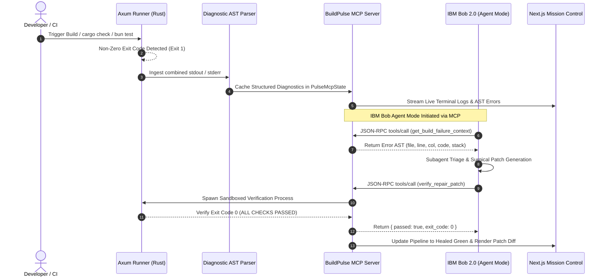

# BuildPulse: Technical Architecture & System Blueprint

## Executive Overview
BuildPulse is an autonomic, closed-loop build and test remediation engine built specifically for **IBM Bob 2.0** and the **Model Context Protocol (MCP)**. It bridges a high-throughput **Rust (Axum + Tokio)** subprocess execution runtime with an enterprise **Next.js 16** mission control interface, enabling autonomous AI-driven triage, surgical patch generation, and sandboxed test verification with zero human intervention.

---

## 1. System Topology & Component Interactions



---

## 2. Core Subsystems

### A. Subprocess Runner (`api/src/features/build_pulse/runner.rs`)
- **Async Execution:** Spawns asynchronous child processes using `tokio::process::Command` without blocking the Axum request runtime.
- **Precision Metrics:** Measures runtime execution down to microsecond fidelity using `std::time::Instant`.
- **Stream Redirection:** Aggregates and normalizes `stdout` and `stderr` streams into a unified terminal buffer for client-side rendering.

### B. Compiler Diagnostic Parser (`api/src/features/build_pulse/diagnostics.rs`)
Extracts structured diagnostic objects from raw compiler dumps:
- **Rustc Grammar:** Matches compiler diagnostic patterns:
  `error[E0308]: mismatched types --> src/features/auth/handlers.rs:42:15`
  Captures: `error_code`, `message`, `file_path`, `line_number`, and `column`.
- **TypeScript Grammar:** Matches TypeScript compiler and Bun test traces:
  `src/features/auth/types.ts:18:5 - error TS2339: Property 'workspaceId' does not exist`

### C. Model Context Protocol (MCP) Server (`api/src/features/build_pulse/mcp.rs`)
Implements the JSON-RPC 2.0 Model Context Protocol specification:
- **`tools/list`**: Exposes registered capabilities:
  - `get_build_failure_context`: Ingests the cached failure AST and stack trace.
  - `verify_repair_patch`: Executes sandboxed verification runs against `rust` or `web` targets.
- **`tools/call`**: Processes tool invocations from Bob IDE and dispatches sandboxed verification.

### D. Mission Control UI (`web/features/build-pulse/`)
Built with React 19, Tailwind CSS v4, and Zustand:
- **`TerminalStream`**: Real-time ANSI terminal viewer with syntax-highlighted error states.
- **`AgentTracker`**: 4-stage visual progress pipeline (`Intercept` $\rightarrow$ `Triage` $\rightarrow$ `Patch` $\rightarrow$ `Verify`).
- **`CodeDiffViewer`**: High-contrast side-by-side patch diff viewer rendering modified AST nodes.

---

## 3. Protocol Data Contracts

### MCP Request (JSON-RPC 2.0)
```json
{
  "jsonrpc": "2.0",
  "id": 1,
  "method": "tools/call",
  "params": {
    "name": "verify_repair_patch",
    "arguments": {
      "target": "rust"
    }
  }
}
```

### MCP Response (JSON-RPC 2.0)
```json
{
  "jsonrpc": "2.0",
  "id": 1,
  "result": {
    "content": [
      {
        "type": "text",
        "text": "{\"passed\":true,\"exit_code\":0,\"duration_ms\":840,\"raw_summary\":\"ALL CHECKS PASSED. Build verified green.\"}"
      }
    ]
  }
}
```

---

## 4. Security & Compliance
- **Credential Protection:** Shielded via `.bobignore` from commit #0 to prevent secret and key leakage.
- **Sandboxed Execution:** Verification processes execute within isolated Tokio subprocess trees with resource limits.
- **Zero Panic Guarantee:** Centralized `AppError` mapping prevents API process crashes.
